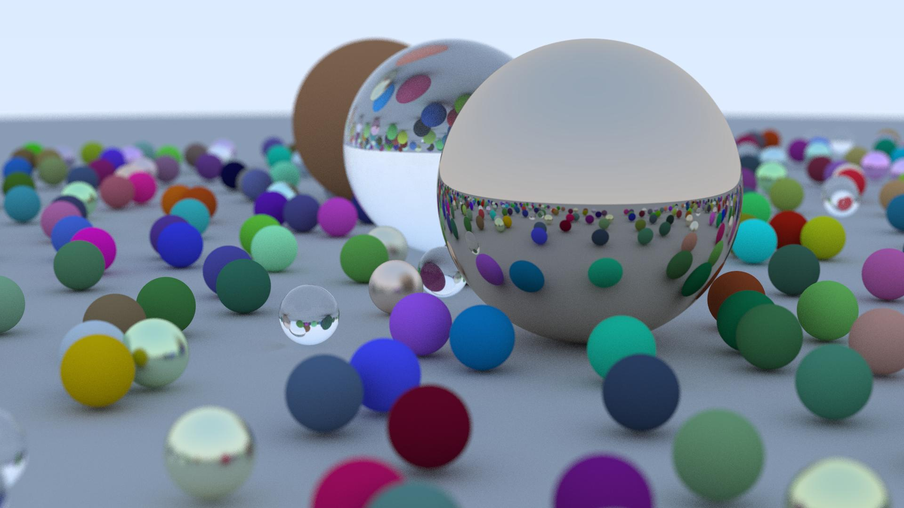
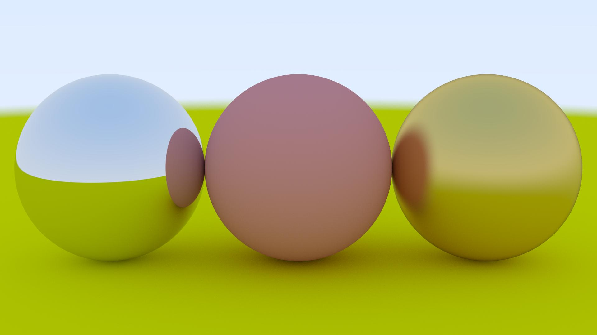

# raytracercpp (WIP)
Basic raytracer in C++ developed for fun and learning purposes from scratch. It outputs a .ppm image based on the scene defined in-code. Currently only spheres are supported along with lambertian, metallic and dielectric materials.

<p align="center">
  
  
</p>

## Features
* Currently only a sphere geometry is supported.
* Difuse (Lambertian), metallic and translucent (Dielectric) materials.
* Materials include configurable attributes such as fuzzines for metallic surfaces.
* Depth of Field.
* Antialiasing.
* Positionable camera.

## Future features
* Multi-threading.
* Polygon geometry support
* Scene configuration from a config file.

## Usage

The raytracer must be built from code, (no binary is bundled) before it can be executed.
The only requirements are a C++ compiler with c++14 support and CMake.

1. Build the software:

    ```sh
    $ cmake .
    $ cmake --build .
    ```

2. Execute the raytracer and store the image:

    ```sh
    $ ./raytracer > image.ppm
    ```
3. You can use any software to convert from .ppm to a more desirable image format:

    ```sh
    $ pnmtojpeg image.ppm > image.jpeg
    ```